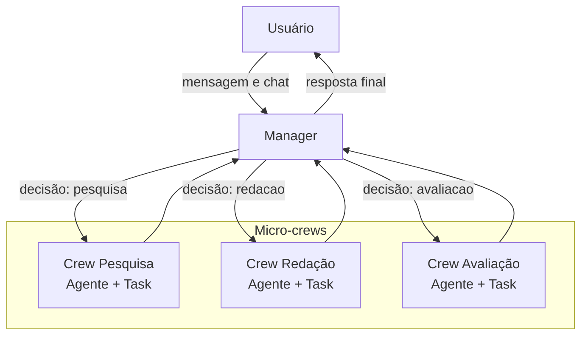

# Multi-Crews Chat

Este projeto implementa um sistema de chat multi-agente usando `crewai` e `fastapi`, orquestrado com `docker-compose`. O sistema é composto por um serviço de gerenciamento e três serviços de "crew" (equipe), cada um com uma função específica: pesquisa, redação e avaliação.

## Arquitetura

O sistema utiliza uma arquitetura de microserviços, onde cada agente (crew) opera de forma independente e é gerenciado por um serviço central.



- **Manager**: O serviço principal que recebe as mensagens do usuário e as direciona para a equipe apropriada.
- **Crew Pesquisa**: Responsável por realizar pesquisas sobre um determinado tópico.
- **Crew Redação**: Responsável por escrever um artigo com base em um tópico e pesquisa.
- **Crew Avaliação**: Responsável por avaliar um artigo.

## CrewAI, Crew e Flow

Este projeto utiliza a biblioteca `crewai` para criar e gerenciar os agentes de IA. O `crewai` é um framework que ajuda a orquestrar agentes autônomos, permitindo que eles trabalhem juntos para realizar tarefas complexas.

### Crew

Uma `Crew` (equipe) é um grupo de agentes que trabalham juntos para atingir um objetivo comum. Neste projeto, temos quatro equipes:

- **Manager Crew**: Contém o `router_agent` que decide qual equipe deve ser acionada.
- **Pesquisa Crew**: Contém o `pesquisador` agente.
- **Redação Crew**: Contém o `redator` agente.
- **Avaliação Crew**: Contém o `avaliador` agente.

### Flow

O `flow` (fluxo) de uma equipe define como as tarefas são executadas. Neste projeto, usamos o `Process.sequential`, o que significa que as tarefas são executadas uma após a outra, em ordem. A saída de uma tarefa serve como entrada para a próxima, criando um fluxo de trabalho coeso e passo a passo.

## Serviços

Cada serviço é um aplicativo `fastapi` executado em seu próprio contêiner Docker.

### Manager

- **Endpoint**: `POST /chat`
- **Descrição**: Recebe uma mensagem do usuário e usa um `router_agent` para decidir qual equipe chamar. Em seguida, ele chama o endpoint `/kickoff` da equipe apropriada e retorna a resposta ao usuário.

### Crew Pesquisa

- **Endpoint**: `POST /kickoff`
- **Agente**: "Pesquisador Acadêmico"
- **Objetivo**: Encontrar informações confiáveis sobre o tópico solicitado.

### Crew Redação

- **Endpoint**: `POST /kickoff`
- **Agente**: "Escritor" (inferido)
- **Objetivo**: Escrever um artigo com base em um tópico e nos resultados da pesquisa.

### Crew Avaliação

- **Endpoint**: `POST /kickoff`
- **Agente**: "Avaliador" (inferido)
- **Objetivo**: Avaliar a qualidade de um artigo.

## Como Começar

Para executar o projeto, você precisará ter o Docker e o `docker-compose` instalados.

1.  **Clone o repositório:**

    ```bash
    git clone https://github.com/adilsonmenechini/multi-crews-chat.git
    cd multi-crews-chat
    ```

2.  **Inicie os serviços:**

    ```bash
    docker-compose up -d
    ```

    Isso irá construir e iniciar todos os serviços definidos no arquivo `docker-compose.yml`.

## Uso

Você pode interagir com o sistema de chat enviando uma solicitação POST para o endpoint `/chat` do serviço de gerenciamento.

**Exemplo de solicitação:**

```bash
curl -X POST "http://localhost:8000/chat" -H "Content-Type: application/json" -d '''{"text": "Qual é o estado da arte em IA generativa?"}'''
```

O `manager` irá encaminhar esta solicitação para a equipe de `pesquisa`, que irá pesquisar o tópico e retornar um resumo.
